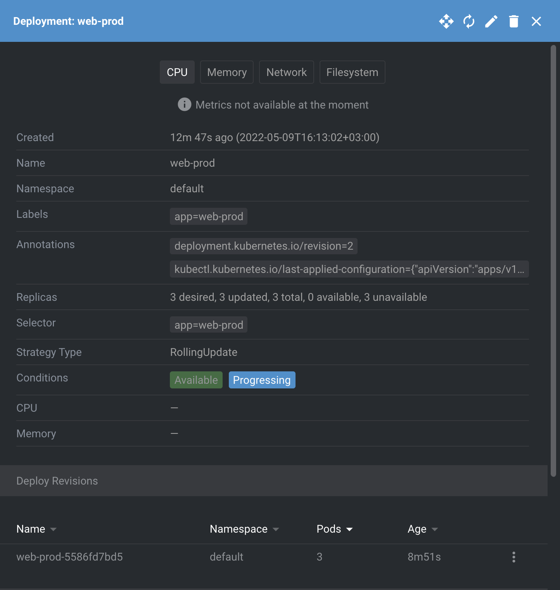
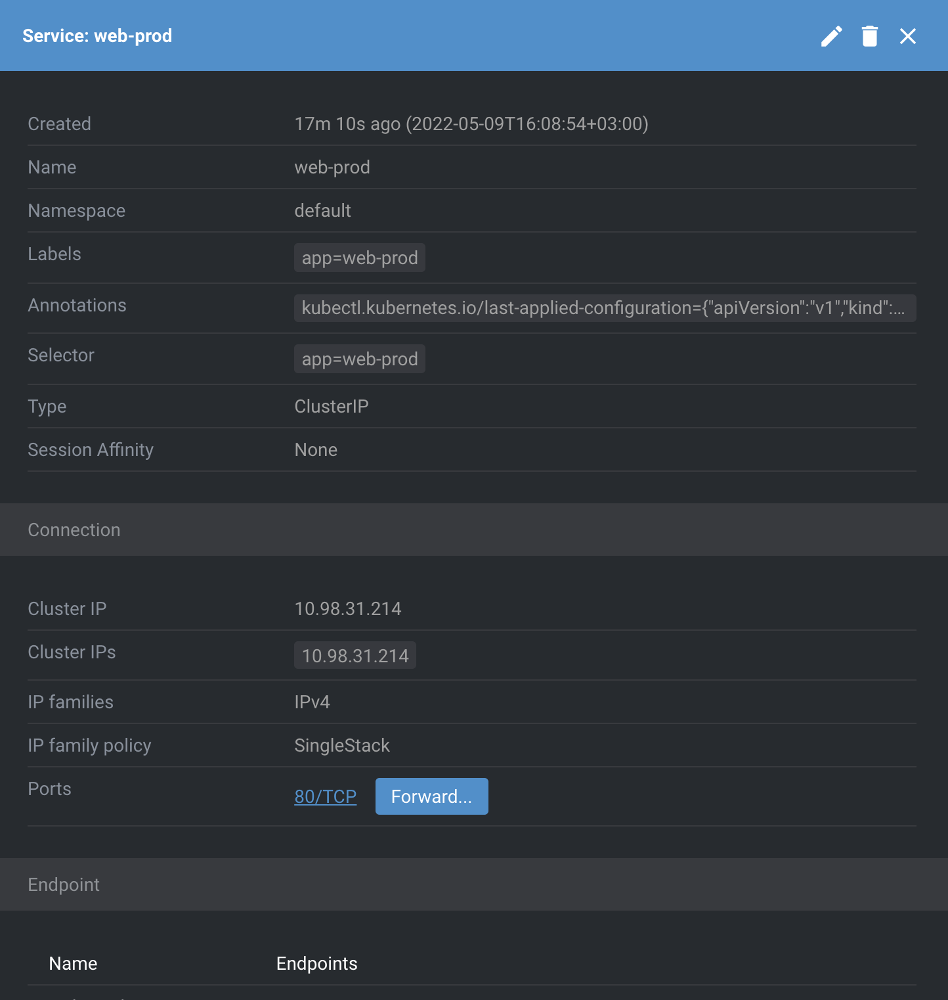
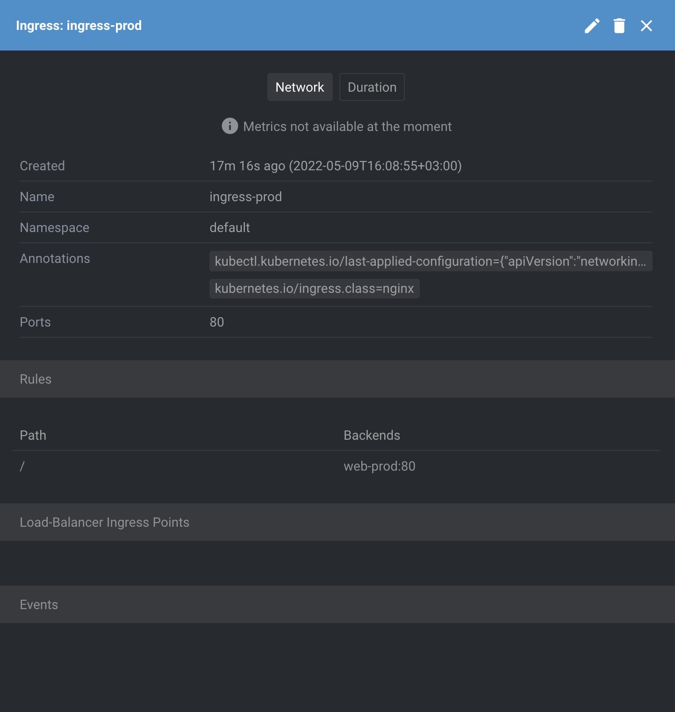
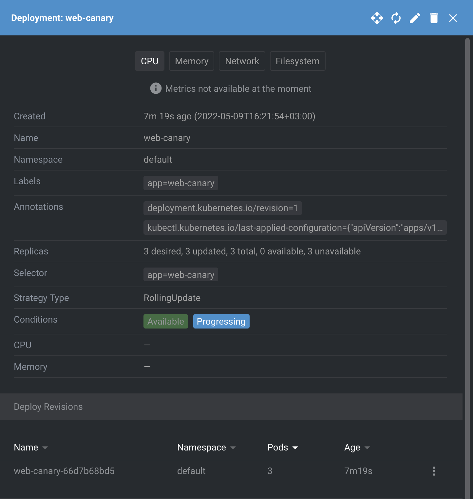
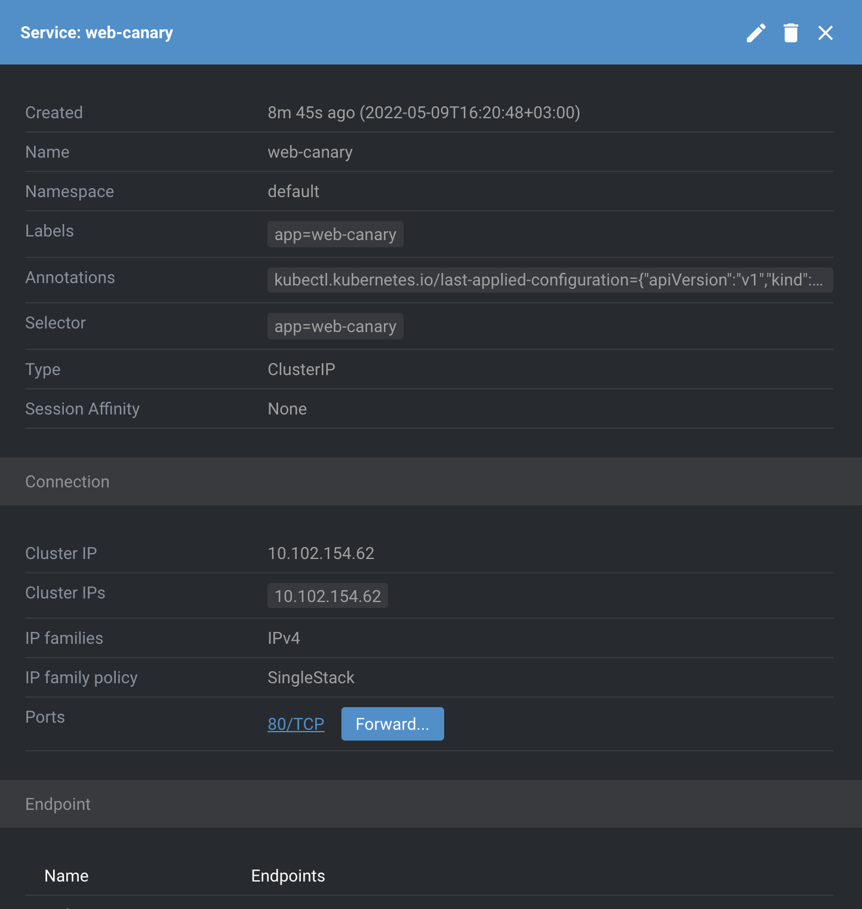

## In Minikube in namespace kube-system, there are many different pods running. Your task is to figure out who creates them, and who makes sure they are running (restores them after deletion).

```
kubectl get all -n kube-system
NAME                                         READY   STATUS    RESTARTS         AGE
pod/coredns-78fcd69978-hpkx9                 1/1     Running   18 (49m ago)     42d
pod/coredns-78fcd69978-mzb2f                 1/1     Running   18 (49m ago)     42d
pod/etcd-docker-desktop                      1/1     Running   19 (49m ago)     42d
pod/kube-apiserver-docker-desktop            1/1     Running   73 (49m ago)     42d
pod/kube-controller-manager-docker-desktop   1/1     Running   22 (49m ago)     42d
pod/kube-proxy-76bbt                         1/1     Running   18 (49m ago)     42d
pod/kube-scheduler-docker-desktop            1/1     Running   46 (49m ago)     42d
pod/storage-provisioner                      1/1     Running   111 (49m ago)    42d
pod/vpnkit-controller                        1/1     Running   175 (5m2s ago)   42d

NAME               TYPE        CLUSTER-IP   EXTERNAL-IP   PORT(S)                  AGE
service/kube-dns   ClusterIP   10.96.0.10   <none>        53/UDP,53/TCP,9153/TCP   42d

NAME                        DESIRED   CURRENT   READY   UP-TO-DATE   AVAILABLE   NODE SELECTOR            AGE
daemonset.apps/kube-proxy   1         1         1       1            1           kubernetes.io/os=linux   42d

NAME                      READY   UP-TO-DATE   AVAILABLE   AGE
deployment.apps/coredns   2/2     2            2           42d

NAME                                 DESIRED   CURRENT   READY   AGE
replicaset.apps/coredns-78fcd69978   2         2         2       42d
```


## Answer:

Controlled by higher level kubernetes like Deployment, Replicaset, Replication controller.


---
# Prod deployment
```
kubectl apply -f deployment-prod.yaml
kubectl apply -f service-prod.yaml
kubectl apply -f ingress-prod.yaml
```





---


# Canary deployment
```
kubectl apply -f deployment-canary.yaml
kubectl apply -f service-canary.yaml
kubectl apply -f ingress-canary.yaml
```





---
## kubectl get all


---
## Destination traffic


