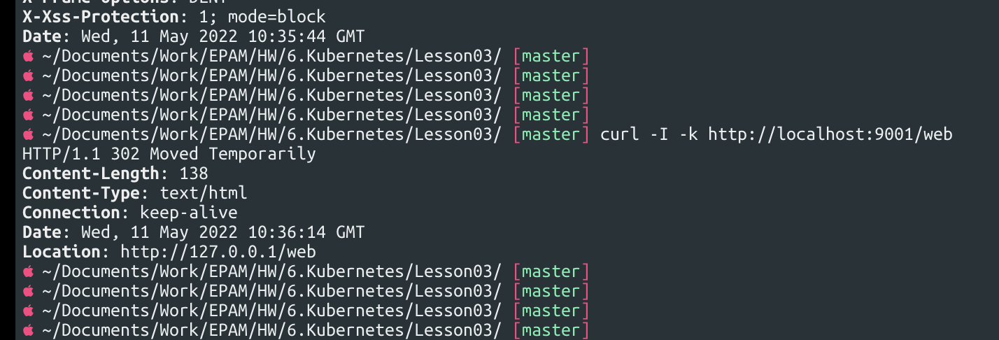

# Task 3

### Homework

## We published minio "outside" using nodePort. Do the same but using ingress.

### Apply configs
```bash
kubectl apply -f pv.yaml
kubectl apply -f pvc.yaml
kubectl apply -f deployment.yaml
kubectl apply -f minio-service.yaml
kubectl apply -f ingress-outside.yaml
```


### Trying to connect ip_minikube


## Publish minio via ingress so that minio by ip_minikube and nginx returning hostname (previous job) by path ip_minikube/web are available at the same time.

### Delete priveous ingress and apply new config
```bash
kubectl delete -f ingress-outside.yaml
kubectl apply -f ingress.yaml
```

### Trying to connect ip_minikube and we can see redirect ip_minikube/web


### Trying to connect ip_minikube/web


## Create deploy with emptyDir save data to mountPoint emptyDir, delete pods, check data.

### Apply config
```bash
kubectl apply -f deployment-empty_dir.yaml
```

### Create file in volume && Check volume && delete pod && get pod name && connect new pod && see that "test_file_serov" file also be deleted


